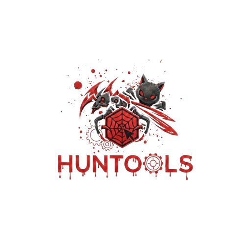
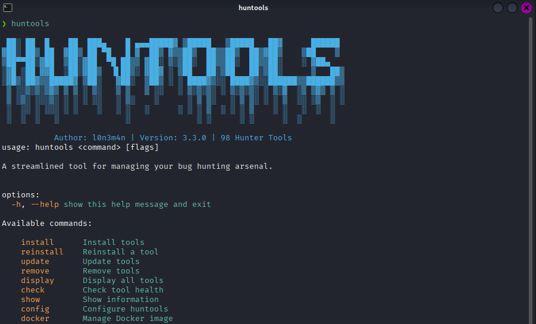
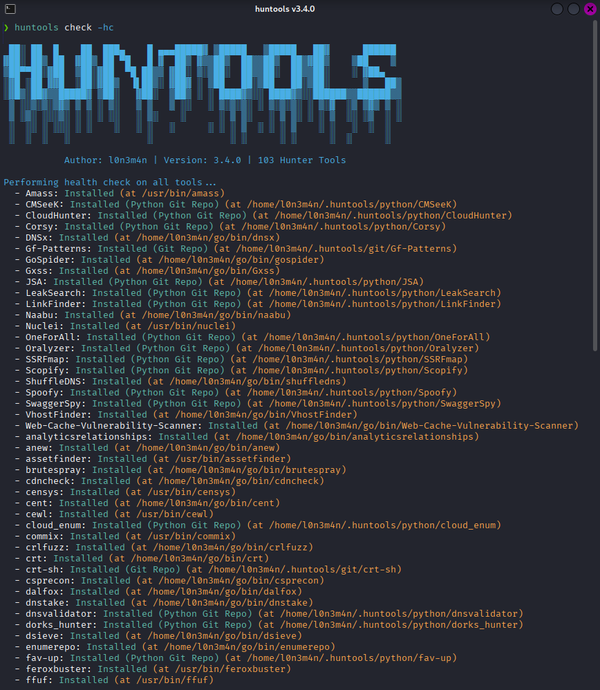
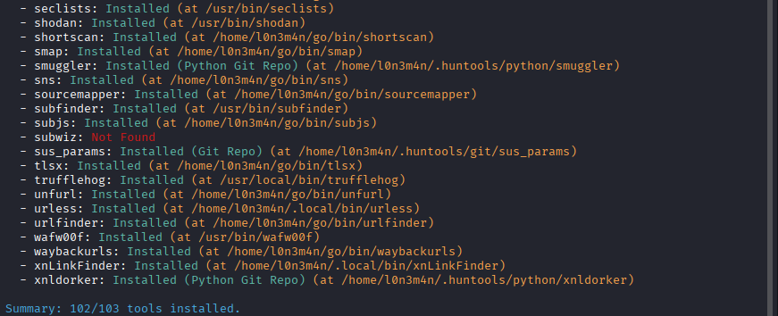
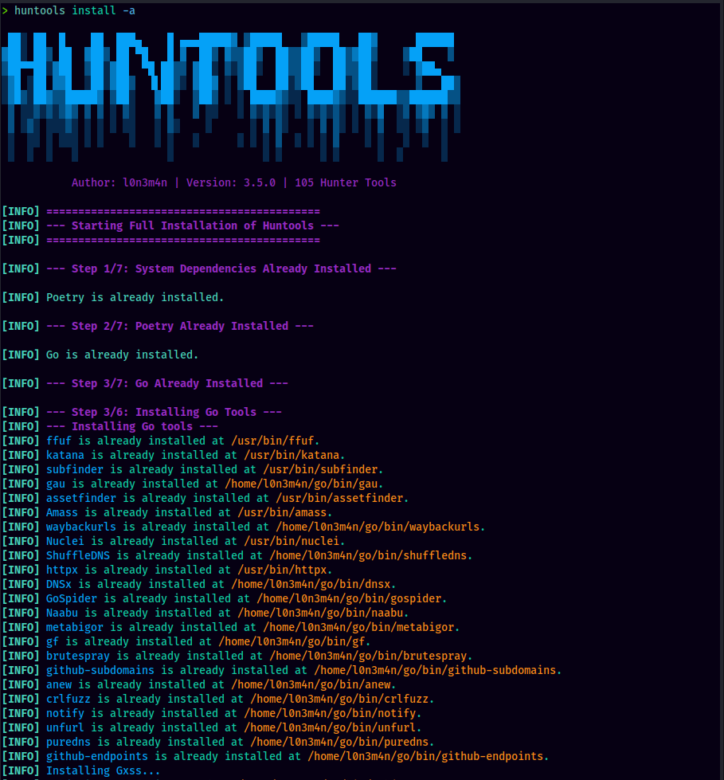

<p align="center">
  
</p>
<p align="center">
    <a href="https://visitorbadge.io/status?path=https%3A%2F%2Fgithub.com%2Fl0n3m4n%2Fhuntools">
        
    </a>
    <a href="https://www.facebook.com/UEVOLVJU">
        
    </a>
      <a href="https://www.twitter.com/UEVOLVJU">
        
    </a>
    <a href="https://medium.com/@l0n3m4n">
        
    </a>
    <a href="https://www.buymeacoffee.com/l0n3m4n">
        
    </a>  
    <a href="mailto:l0n3m4n@proton.me">
      
    </a>
</p>
<br/>


Huntools is a Python-based command-line utility designed for penetration testers and bug bounty hunters. It simplifies the installation and management of a wide range of tools used for reconnaissance, vulnerability analysis, and exploitation. With Huntools, you can ensure your toolkit stays consistent, optimized, and portable, giving you full control and making it easier to stay prepared for any critical operation.


## 🚀 Features

- ✅ **Robust Installation:** Automated installation of tools via system package managers, pip, or Git cloning.
- 🛡️ **Checksum Verification:** Ensures integrity of downloaded Go tools to prevent corruption.
- 🩹 **Installation Handling:** Detects and repairs partially cloned Git repositories.
- 🔄 **Reinstall Command:** Easily fix corrupted tools by performing a fresh reinstallation.
- 🛠️ **Tool Management:** All tools are managed from a single, extensible data structure, making the script maintainable.
- 🔍 **Smart Checks:** Skips installation if a tool is already present in your system's PATH.
- 🌐 **Cross-Platform:** Designed to work across various operating systems, Linux distrus Debian, Ubuntu, Fedora, and Arch
- 🐳 **Docker Support:** Generate a `Dockerfile` to create a consistent and portable Huntools environment.

---

 




---

## 💡 Usage and Installation: 
> requirements
- `python3 latest` 
- `sudo apt instll pip -y && pip3 install PyYaml`
### 🚀 Initial Setup & Installation

- **Clone the Huntools Repository:**    
```bash
git clone https://github.com/l0n3m4n/huntools.git
cd huntools

# Install All Tools (Recommended for First-Time Setup)
sudo python3 huntools.py install -a

# Install a Single Tool
sudo python3 huntools.py install -s <tool_name>

# Install Multiple tools
sudo python3 huntools.py install -m ffuf,feroxbuster,gobuster

# System-wide Installation (e.g. /local/bin)
sudo python3 huntools.py install -is
```

### ⚙️ Advanced Installation

- **Install Dependencies Only:**
  If you want to install only the system-wide dependencies without installing any tools, use the `--deps-only` flag. This is useful for preparing an environment.
  ```bash
  sudo python3 huntools.py install --deps-only
  ```

- **Control Concurrency:**
  You can control the number of concurrent threads used for installing tools with the `-t` or `--threads` flag. By default, it runs sequentially (`-t 1`).
  ```bash
  # Install all tools using 8 threads
  sudo python3 huntools.py install -a -t 8

  # Install multiple tools using 4 threads
  sudo python3 huntools.py install -m ffuf,httpx -t 4
  ```

### ⚙️ Customizing Huntools (Configuration)
```bash
# Specify a Custom Configuration File Path
python3 huntools.py config -cp ~/.my_custom_huntools_config/config.yml

# Set a Custom Directory for Downloaded Binaries
python3 huntools.py config -bp /opt/huntools_binaries

# Define the Installation Directory for All Tools
python3 huntools.py config -ip /opt/huntools_tools
```

### 🔄 Managing & Maintaining Your Tools
```bash
# Update All Tools
huntools update -ua

# Update a Single Tool
huntools update -s <tool_name>

# Update Huntools Itself
huntools update -su

# Reinstall a Tool
huntools reinstall <tool_name>

# Check Tool Health
huntools check -hc
```

### 🔍 Viewing Information
```bash
# Display All Available Tools
huntools display -a

# Show Huntools Paths
huntools show -pl

# View Changelog
huntools show -cl
```

### 🗑️ Removing Tools & Data
```bash
# Remove a Single Tool
huntools remove -rs <tool_name>

# Remove All Tools
huntools remove -ra

# Purge All Huntools Data
huntools remove -ca
```

### 🐳 Docker Integration

```bash
# Generate the Dockerfile
python3 huntools.py docker -g
# path 
python3 huntools.py docker -g -s my_custom_dockerfile

# Build the Docker Image
docker build -t huntools-env .

# Run the Docker Container
docker run -it huntools-env bash

# Execute a Huntools Command Directly
docker run huntools-env huntools <command> [options]
```

---


## 🛠️ Available Tools

list of all the tools that Huntools can manage.

### Go Tools

| | | | |
|---|---|---|---|
| ffuf | feroxbuster | katana | subfinder |
| assetfinder | gau | waybackurls | Amass |
| httpx | GoSpider | ShuffleDNS | Nuclei |
| DNSx | Naabu | ct-exposer | metabigor |z
| gf | brutespray | qsreplace | github-subdomains |
| gitlab-subdomains | anew | notify | unfurl |
| github-endpoints | subjs | Gxss | crlfuzz |
| dalfox | puredns | interactsh-client | analyticsrelationships |
| gotator | roboxtractor | mapcidr | cdncheck |
| dnstake | tlsx | gitdorks_go | smap |
| dsieve | inscope | enumerepo | Web-Cache-Vulnerability-Scanner |
| hakip2host | mantra | crt | s3scanner |
| nmapurls | shortscan | sns | ppmap |
| sourcemapper | jsluice | urlfinder | cent |
| csprecon | VhostFinder | misconfig-mapper | gitleaks |
| trufflehog | qsreplace |  |  |

### Python Tools

|  |  |  |  |
|---|---|---|---|
| LinkFinder | OneForAll | cloud_enum | dorks_hunter |
| Corsy | CMSeeK | fav-up | Oralyzer |
| JSA | CloudHunter | pydictor | smuggler |
| regulator | nomore403 | SwaggerSpy | LeakSearch |
| Spoofy | msftrecon | Scopify | metagoofil |
| censys | shodan | wafw00f | commix |
| urless | xnLinkFinder | porch-pirate | p1radup |
| SSRFmap | | | |
|  |  |  |  |

### Git Repos

|  |  |
|---|---|
| Gf-Patterns | sus_params |

### Package Tools

|  |  |  |  |
|---|---|---|---|
| seclists | jq | flameshot | lsd |
| cewl | nmap | massdns | dirsearch |


 ## 🔐 GitHub Token (Optional)
Set a GitHub token to avoid API rate limits during repo searches:
```bash
export GITHUB_TOKEN=ghp_yourtokenhere
```
You can create one at: https://github.com/settings/tokens

---

## 🙌 Contributing
Pull requests are welcome! If you'd like to contribute tools or improvements, feel free to fork and submit a PR.

📣 Disclaimer

This tool is provided as-is for educational and lawful bug bounty purposes. Use it responsibly and only on systems you own or have explicit permission to test.

Stay sharp, stay secure.
