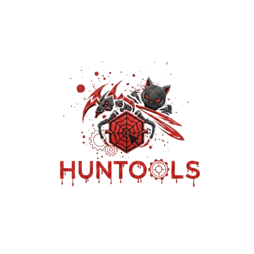
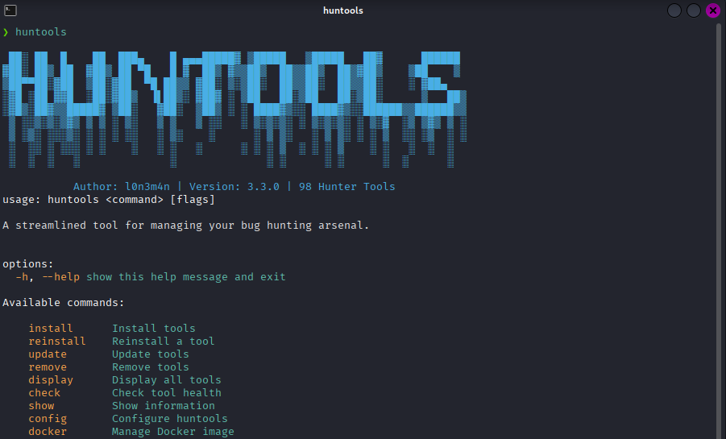
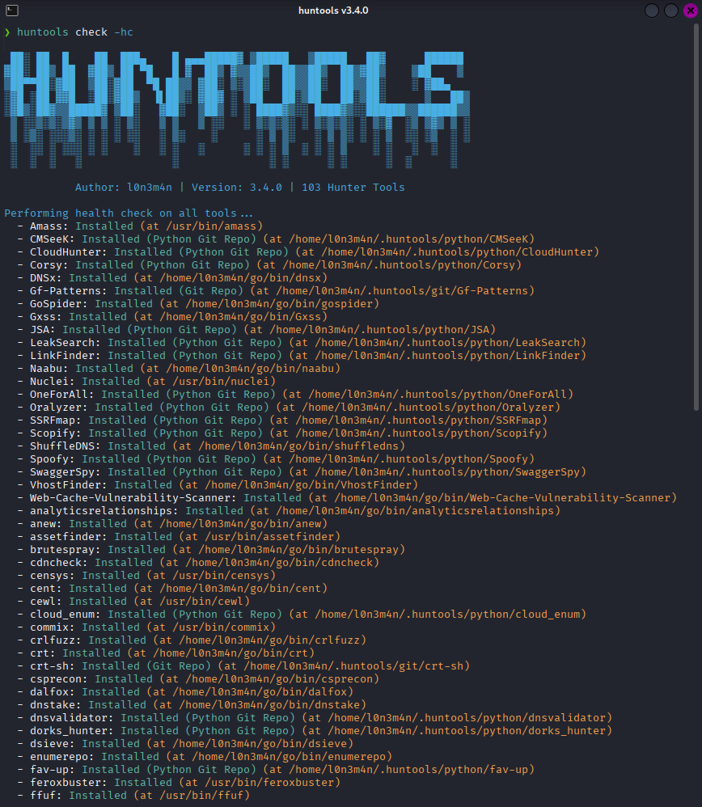
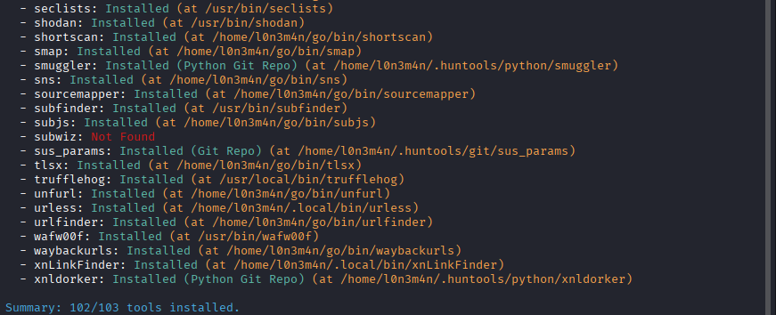

  

    
    
      
    
      
    

 

Huntools is a Python based command line utility crafted for penetration testers and bug bounty hunters. It    
provides a robust and streamlined solution for managing your entire arsenal of reconnaissance, vulnerability analysis, exploitation tools etc. With this tool you gain    
unparalleled control over tool installation, ensuring your toolkit is always optimized, consistent, portable, and ready  
for critical operations.

## 🚀 Features

- ✅ **Robust Installation:** Automated installation of tools via system package managers, pip, or Git cloning.
- 🛡️ **Checksum Verification:** Ensures integrity of downloaded Go tools to prevent corruption.
- 🩹 **Installation Handling:** Detects and repairs partially cloned Git repositories.
- 🔄 **Reinstall Command:** Easily fix corrupted tools by performing a fresh reinstallation.
- 📊 **Tool Count:** The banner now dynamically displays the total number of available tools.
- 🛠️ **Tool Management:** All tools are managed from a single, extensible data structure, making the script maintainable.
- 🔍 **Smart Checks:** Skips installation if a tool is already present in your system's PATH.
- 🌐 **Cross-Platform:** Designed to work across various operating systems, Linux distrus Debian, Ubuntu, Fedora, and Arch
- 🐳 **Docker Support:** Generate a `Dockerfile` to create a consistent and portable Huntools environment.
- ⚙️ **Configuration Validation:** Implemented validation for `config.yml` to ensure correct paths and values, improving script robustness.
- ⚡ **Parallel Installation:** Enhanced `install_multiple` and `install_all` functions to use `ThreadPoolExecutor` for concurrent tool installations, significantly speeding up the process.
- 🚨 **Improved Error Reporting:** Added timestamps to error logs and included a comprehensive installation summary in `errors.log` for better debugging.
- 📄 **Flexible Output Formats:** Extended the `display` command with a `--format json` option to output the list of available tools in JSON format.
- 🧪 **Automated Testing:** Introduced a `pytest` test suite with initial tests for configuration validation, ensuring code quality.
- 🚀 **CI/CD Integration:** Added a GitHub Actions workflow (`.github/workflows/ci.yml`) to automatically run tests on push and pull requests, streamlining development.

---

 

---
